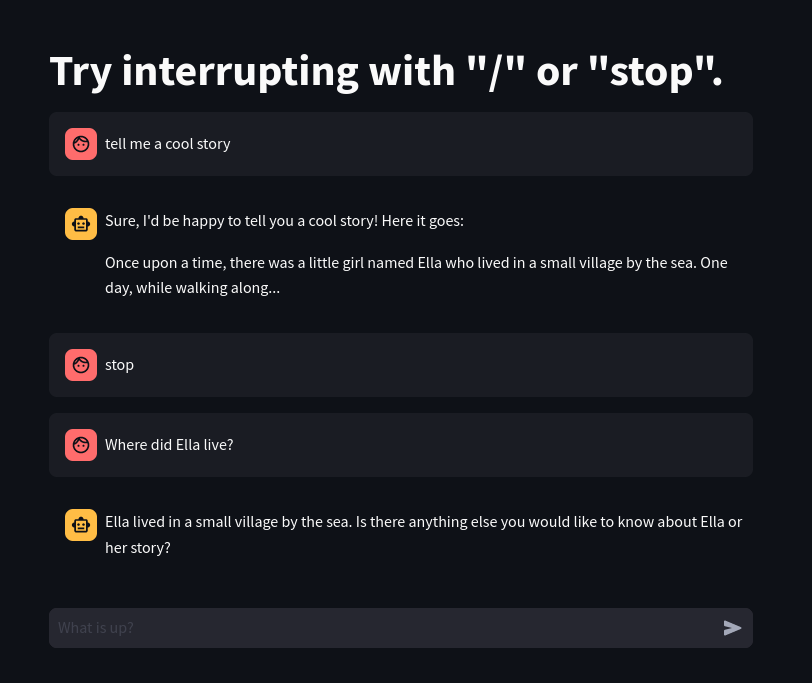

# Shutup Llama

**An interruptable, streaming chat application build on Ollama and Streamlit.**

Some LLM models can be slow, especially if they are run on local hardware. This motivates building a streaming application where the user doesn't have to wait for everything to finish to start seeing text.

But how do you interrupt a reply in Streamlit while still capturing as much as was finished? This is an example app that shows one approach to that task.

### Quickstart:

```bash
# create a virtual environment
python3 -m venv /path/to/veShutupLlama
source /path/to/veShutupLlama/bin/activate
# install dependencies
pip3 install -r requirements.pip
# Select a model
export MODEL="phi:2.7b"
# Run the app
streamlit run shutup_llama.py
```


If the user types "stop", "bye", or anything starting with "/" while the reply is streaming, the reply to that point will be captured and the conversation paused. See the example below:



